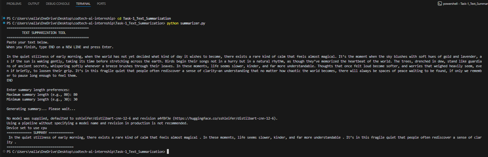

# TASK 1 – TEXT SUMMARIZATION TOOL

**Company:** CODTECH IT SOLUTIONS PVT. LTD  
**Name:** Venkata Sai Tejaswi Nallamilli  
**Intern ID:** CTIS3591  
**Domain:** Artificial Intelligence  
**Duration:** 6 Weeks  
**Mentor:** Neela Santhosh Kumar  

---

## Description

The Text Summarization Tool developed in this task is designed to simplify long textual content and convert it into concise, meaningful summaries using modern Natural Language Processing (NLP) techniques. In today’s digital world, individuals and organizations continuously deal with large amounts of text—whether it is research articles, news articles, reports, or educational material. Manually reading and extracting key information from lengthy text can be time-consuming and inefficient. This project addresses that issue by leveraging a transformer-based summarization model to automatically analyze and condense text while preserving the original meaning.

The tool is built using the HuggingFace Transformers library, which provides access to powerful pretrained models trained on massive datasets. Instead of manually designing summarization logic or rule-based systems, this approach uses deep learning models that understand grammar, context, sentence structure, and semantic meaning. These models are based on encoder-decoder architectures that perform sequence-to-sequence learning. In simple terms, the model reads the input text, processes it internally, and generates a shorter output text representing the summary.

One of the key aspects of this project is its ability to handle multi-line input from the user. The program continuously accepts lines of text until the user types ‘END’, making it suitable for long paragraphs and bulk text pasted directly from websites or documents. After collecting the input, the script sends it to the summarization model, which processes the text and returns a refined, shortened version. This summarizer is particularly useful for students, researchers, and professionals who want quick insights without reading entire documents.

The model used in the tool operates without sampling, meaning it aims for the most deterministic and accurate summary possible. This prevents randomness and ensures consistency in summarization output. The summarizer automatically adjusts to different input lengths, making it flexible for varying use cases.

From a technical perspective, this task demonstrates essential NLP concepts like tokenization, attention mechanisms, contextual embeddings, and model inference. It also introduces the idea of using pretrained models instead of training from scratch. This greatly reduces computational cost and allows the system to run efficiently on normal hardware without requiring GPUs.

The summarization tool not only shows how NLP can transform raw text into useful information but also reflects how AI-driven automation can save time and improve productivity. Whether for academic summaries, meeting notes, or article compression, this tool provides a practical and effective solution. Overall, Task 1 highlights the power of transformer models and introduces an important real-world AI application with immediate usefulness and relevance.

---

## How to Run

1. Install dependencies:
pip install -r requirements.txt

2. Run the script:
python summarizer.py

3. Paste your input text  
4. Type `END` to generate summary

---

## Output Screenshot

