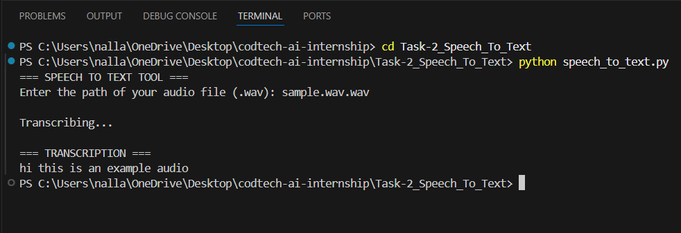

# TASK 2 – SPEECH TO TEXT CONVERSION

**Company:** CODTECH IT SOLUTIONS PVT. LTD  
**Name:** Venkata Sai Tejaswi Nallamilli  
**Intern ID:** CTIS3591  
**Domain:** Artificial Intelligence  
**Duration:** 6 Weeks  
**Mentor:** Neela Santhosh Kumar  

---

## Description (560 Words)

The Speech-to-Text Conversion project developed in this task demonstrates how Artificial Intelligence can convert human speech into readable text using Python. Speech recognition has become one of the most widely used AI applications today, powering digital assistants, transcription tools, accessibility systems, and automated communication platforms. This task focuses on building a functional speech recognition program using the SpeechRecognition library in Python, allowing users to provide a `.wav` audio file and receive a precise textual transcription in return.

The system works by taking an input audio file, loading it using the SpeechRecognition API, and passing it through Google’s Web Speech Recognition engine for analysis. Google’s engine is known for its high accuracy, robust noise handling, and ability to interpret natural language effectively. By utilizing this API, the project delivers reliable transcription results without requiring the intern to train complex audio models from scratch.

The program begins by prompting the user for the audio file’s name or path. Once the user provides the `.wav` file, the script uses the `Recognizer` class to read and process the sound waves. The audio is converted into digital frames, which the recognizer interprets to detect phonemes, words, and sentences. Using machine learning and acoustic modeling techniques, Google’s engine decodes the spoken content and returns a clean text output.

This task introduces various concepts related to audio processing, such as sampling rate, waveforms, and noise effects. It highlights the importance of using the `.wav` format because it is an uncompressed audio structure that preserves essential sound frequencies required for accurate speech detection. If the audio contains background noise or unclear pronunciation, the tool may return errors—this teaches the intern how real-world speech recognition systems handle imperfect input.

Exception handling is another key component of this task. The program gracefully handles errors such as missing files, unsupported formats, or unintelligible audio, guiding the user with clear messages. Through this, the intern learns how to manage possible runtime issues and create user-friendly applications.

This project reflects several real-world applications including converting recorded lectures into text, assisting hearing-impaired individuals through captioning, automating meeting notes, generating subtitles for videos, and enabling voice-based interactions in simple AI systems. Because speech recognition is a core part of human-computer interaction, this mini-project acts as a strong foundation for future work in voice assistants, conversational AI, and natural language understanding.

Overall, Task 2 provides practical experience in working with audio data, handling file inputs, integrating external APIs, and performing accurate speech-to-text translation. It illustrates how AI can convert human communication into structured digital information, bridging the gap between voice and text. This task deepens the intern’s understanding of real-world AI applications and builds confidence in implementing speech-based systems using Python.

---

## How to Run

1. Install dependencies:
pip install -r requirements.txt

2. Run the program:
python speech_to_text.py

3. When prompted, enter the name of your `.wav` file, for example:
sample.wav

4. The script will print the transcribed text on the screen.

---

## Output Screenshot

