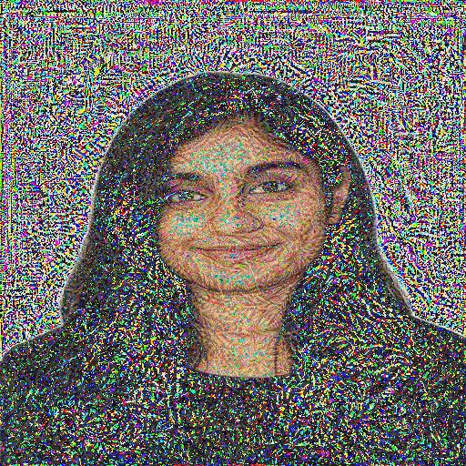

# TASK 3 – NEURAL STYLE TRANSFER

**Company:** CODTECH IT SOLUTIONS PVT. LTD  
**Name:** Venkata Sai Tejaswi Nallamilli  
**Intern ID:** CTIS3591  
**Domain:** Artificial Intelligence  
**Duration:** 6 Weeks  
**Mentor:** Neela Santhosh Kumar  

---

## Description (560 Words)

Neural Style Transfer is one of the most fascinating applications of Artificial Intelligence, demonstrating how deep learning models can understand artistic patterns and apply them to photographs. The goal of this task is to combine the **content** of one image with the **artistic style** of another image to produce a visually creative blend. This technique is based on convolutional neural networks (CNNs), and it showcases how AI can manipulate visual data at a highly advanced level.

In this project, the VGG19 model—one of the most popular CNN architectures—is used to extract both content features and style patterns from two separate images. The content image contains the structure or subject of the final output, whereas the style image contributes the artistic texture, color patterns, and brushstroke-like details. Unlike traditional image editing, where filters are manually designed, neural style transfer relies on optimization and learned feature representations to generate unique images.

The program begins by loading the content and style images and resizing them to a manageable resolution. These images are then converted into tensors so they can be processed by PyTorch. The VGG19 model, pretrained on the ImageNet dataset, is used to extract deep semantic features. While early layers capture textures and colors, deeper layers capture shapes and complex visual structures. Neural style transfer works by matching the content representation of one image and the style representation of another.

To generate the final artistic image, the algorithm creates a copy of the content image and gradually updates it through multiple optimization steps using gradient descent. During each step, the model compares the target image with both the content and style representations. The total loss is computed as a combination of **content loss** (how close the target image is to the original content) and **style loss** (how well the target image reflects the patterns of the style image). Over time, the target image evolves to reflect the content of the first image but with the artistic appearance of the second.

This task teaches important concepts such as feature extraction, optimization, loss balancing, neural network architecture, and computer vision techniques. Since neural style transfer is computationally intensive, it typically runs much faster on GPUs. However, for this internship task, the implementation is optimized to run on CPUs as well, though it requires a longer processing time. The output is saved as `output.jpg`, providing a clear visual demonstration of the model’s transformation capabilities.

Neural style transfer has several interesting real-world applications. It can be used in digital art creation, creative photo editing, animated styling, movie post-production, and AI-driven design tools. Applications like Prisma and DeepArt are built on similar principles, showing how AI can reshape the future of digital creativity. This task demonstrates how AI can go beyond numerical computation and interact with creative fields such as art and design.

Overall, Task 3 provides valuable hands-on experience in computer vision, deep learning, and neural network optimization. It highlights how AI models analyze and merge visual information, producing output that reflects both creativity and computational intelligence. This task strengthens the intern’s understanding of CNNs and encourages exploration of more advanced visual AI techniques.

---

## How to Run

1. Install required libraries:
pip install -r requirements.txt

2. Run the script:
python style_transfer.py

3. When prompted, enter:
content.jpg
style.jpg

4. The output will be saved automatically as:

---

## Output Image

